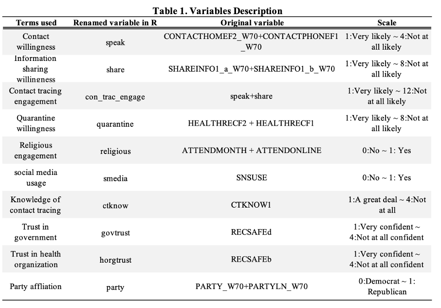
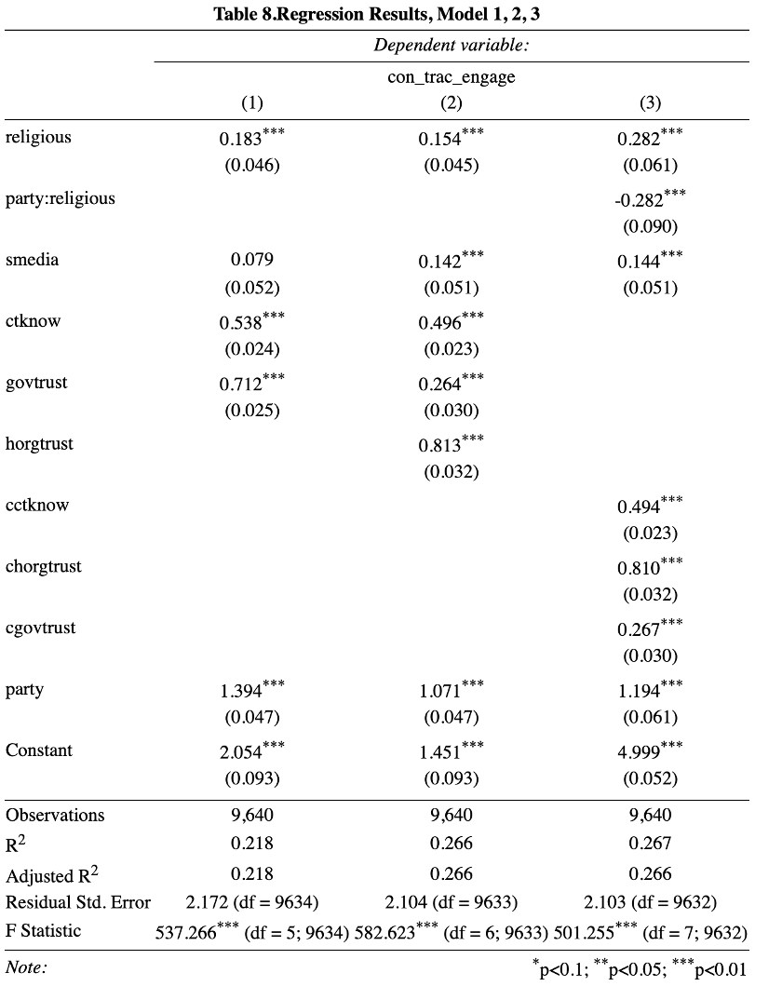
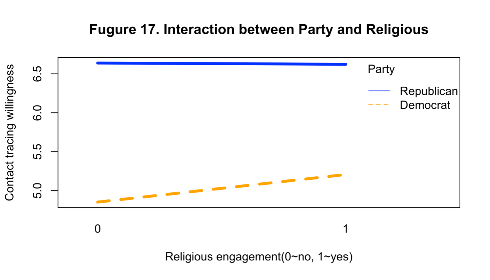

# Evaluation on factors affecting Americans’ participation in contact tracing and quarantine 

## Introduction
Recently, the new variant of covid-19, Omicron, has triggered new tension around the world. It again aroused our cautiousness and alert in this winter. To better inhibit epidemic, we need the engagement of the whole society. The question is to what extent the public is willing to follow the rules? And how can we improve their cooperation with the government? 

In this research report, we focus on factors that have influence on people’s willingness of contact tracing and quarantine during the pandemic, and will provide suggestions on making more effective covid-19 policies.

## Data and Method
### Dataset
We use data from Wave 70 of The American Trends Panel (ATP), which is a national, probability-based online panel of adults living in households in the United States. The topic of this survey is “Religion in public life, social media’s role in politics and society, COVID-19 contact tracing”. 

From the original 142 variables, we choose 14 of them to create 8 new variables we need in our regression model. There are two dependent variables and 6 independent variables. In this analysis, we separately conducted two regression models to examine factors affecting willingness of both quarantine and contact tracing. We decide to conduct two models because we found that people’s attitude towards quarantine has no relationship with their attitude towards contact tracing engagement.  Variables are shown below (for each ordinal variable, smaller number means less likely to participate/less agree with the statement/less knowledge)

### Method
For this analysis report, we use multiple regression to examine the relationship between people’s willingness of participation of covid policy and their social behaviors. Specifically, we are interested in the factors of people’s religious participation, social media using, knowledge of contact tracing, trust to public institutions and their political attitude. Although our dependent variables are ordinal, not continuous, the OLS regression model is helpful for finding out the relationship.

We first examine two models based on two different dependents variables and give them a basic interpretation. Then, we use diagnostics for linear regression on the model, in terms of looking for violations of linearity, homoscedasticity, and normality of residuals, and checking potential outliers. After making appropriate corrections for potential violations, we will compare new model fits to the original one, and draw our conclusion.

## Final Model Performance and interpretations

Both model 2 and 3 are statistically significant with p-value less than .05 for the F-test. The coefficients of all the independents variables are statistically significant with p<0.05. Interpreting model 2, holding other X variables constant: people who use social media is 0.142 unit less likely to engage in covid contact tracing programs than those who do not use; the likelihood of contact tracing engagement willingness increases by 0.496 unit if people have more knowledge of Covid contact tracing programs; people trust public health organizations and federal government are 0.813 and 0.264 unit more likely to engage in covid contact tracing programs respectively than those who do not.

In the interaction model (model 3), we find that the p-value for the party*religious interaction term is significant (p<0.05), meaning that there is evidence for party being moderated by religious (i.e., the impact of religious engagement on people’s contact tracing engagement depends on their party affiliation). Interaction effects plot are showed in figure 17.

Since we have centered all of our continuous variables, the intercept term in model 3 tells us the expected likelihood of contact tracing engagement score (1 denotes very likely and 12 very unlikely) for the "average" person (i.e., a person who is self-identified democrat, a person who DOES NOT engage in religious activities, a person who DOES NOT use social media, a person who has medium knowledge of contact tracing programs and a person who has average trust in public health organizations and federal government.)

To interpret the interaction effect of party affiliation and religious engagement, on average, people’s willingness in engaging contact tracing programs is 0.282 unit higher for those who do not actively engage in religious practice than who DO. However, this disparity is not uniform across party affiliation. A self-identified republican who DOES NOT engage in religious practice is 1.194 less likely to engage in contact tracing program than democrat who DOES NOT engage in religious practice. A self-identified republican who DOES engage in religious practice is 0.282 more likely to engage in contact tracing program than democrat who DOES NOT engage in religious practice. 

## Conclusion
We started by examining initial models of quarantine and contact tracing, but only retained the second one because the former model lacks credibility in interpretations. Interestingly to say, **people’s attitudes towards Covid corporation especially quarantine are quite random,** with only some clues indicating that people who attended religious services within a month, trust federal government, and is self-identified as democrat might more likely to comply with quarantine requirements.

In terms of ‘speak’ and ‘share’ contact tracing information sharing and engagement, the model seems to work well in outcomes delivery. After detailed diagnosis and model iteration, we conclude from our statistically significant model that **religious engagement, social media usage, knowledge of contact tracing programs, party affiliation and trust in health organization and federal government are factors affecting people’s Covid contact tracing engagement.** Based on the interaction effects evaluations, the effect of party affiliation on contact tracing engagement is clearly moderated by religious engagement. **Replicants who are less active in religious engagement in person or online show high willingness to engage in contact tracing programs. People who have high trust in public health organizations shows the highest correlation to contact tracing engagement.**

Those findings inspire government and policy makers in dealing with Covid public health crisis. **Increasing popular trust in people and advocating and educating certain groups of people may help improve public’s willingness to comply with Covid contact racing engagement and requirements**, compliance that is one of the most significant factors in battle with Covid.
